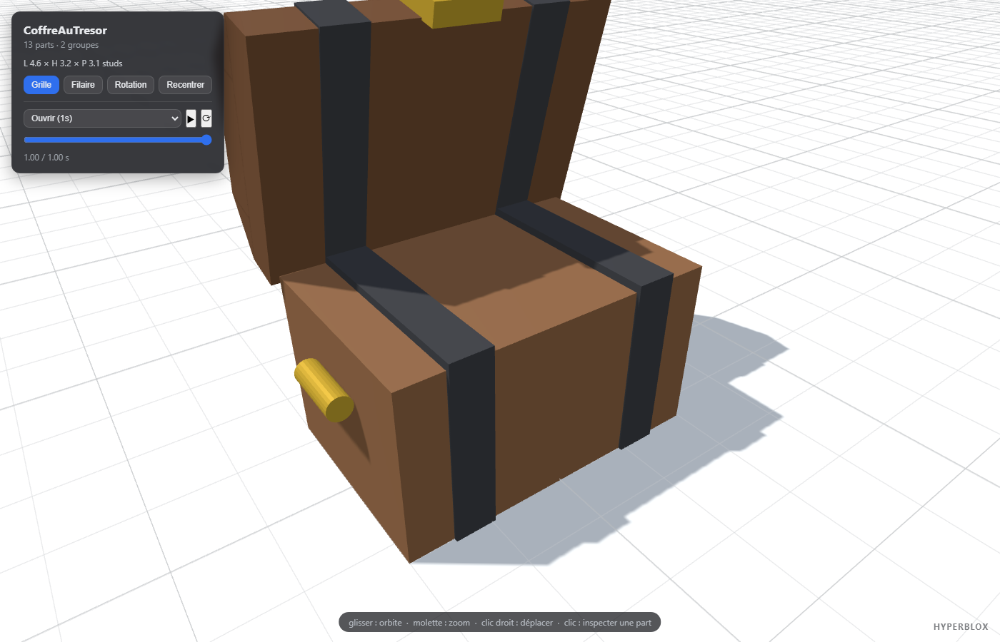
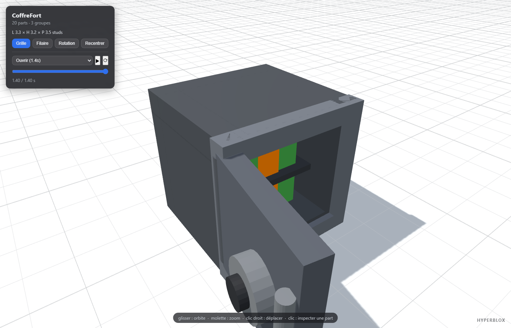

# HyperRoblox

**Image → maquette 3D en HTML → modèle Roblox low-poly. Avec animations.**

HyperRoblox fournit **HyperBlox**, un skill pour [Claude Code](https://claude.com/claude-code)
qui transforme une image (concept art, photo, image IA) en modèle 3D Roblox style
« studio low-poly », en passant par une maquette HTML interactive que vous validez
avant de construire quoi que ce soit dans Roblox Studio.

Même philosophie que les pipelines HTML-vers-vidéo ou HTML-vers-PowerPoint : un
fichier de données unique est la **source de vérité**, la page HTML est la
**maquette à valider**, et la sortie finale est générée depuis les mêmes données.
Ce que la préview montre est ce que Studio construit.

| Coffre au trésor (exemple) | Coffre-fort animé (exemple) |
|---|---|
|  |  |

## Le pipeline

```
image  →  model.json  →  preview.html  →  (validation)  →  build.lua  →  Roblox Studio
          source de       maquette 3D                       script idempotent +
          vérité          interactive                       player d'animations Lua
```

- **`model.json`** — le modèle décrit comme une liste de Parts Roblox (Block,
  Wedge, CornerWedge, Cylinder, Ball — tailles, positions, rotations, couleurs,
  matériaux, groupes) plus des animations par keyframes.
- **`preview.html`** — viewer 3D autonome (Three.js inliné, zéro réseau, zéro
  dépendance) : orbite, zoom, grille façon baseplate, clic sur une part pour
  l'inspecter, et lecture des animations avec scrubber.
- **`build.lua`** — à coller dans la barre de commande de Roblox Studio (ou à
  exécuter via le MCP Roblox Studio). Construit le modèle avec de vraies Parts,
  réexécutable sans risque. Si le modèle a des animations, un ModuleScript
  `HyperBloxAnim` est embarqué : mêmes keyframes, mêmes easings que la préview.

Les conventions géométriques (axes, ordre de rotation `CFrame.fromEulerAnglesXYZ`,
orientation des wedges, cylindres axés sur X…) sont implémentées à l'identique
des deux côtés.

## Installation (skill Claude Code)

Copier le dossier `hyperblox/` dans les skills de votre projet ou de votre machine :

```powershell
# par projet
Copy-Item -Recurse hyperblox <votre-projet>/.claude/skills/hyperblox

# ou global (toutes vos sessions Claude Code)
Copy-Item -Recurse hyperblox ~/.claude/skills/hyperblox
```

Redémarrer la session Claude Code, puis demander par exemple :

> « Crée-moi un modèle Roblox de lampadaire à partir de cette image »

Le skill s'occupe du reste : analyse de l'image, décomposition low-poly,
génération de la maquette, auto-vérification par screenshot, itérations avec
vous, puis livraison du `build.lua`.

### Prérequis

- **Node.js ≥ 18** — aucun `npm install`, le générateur n'a aucune dépendance
  (Three.js est vendoré dans `templates/vendor/`).
- **Roblox Studio** pour la construction finale.
- **Chrome** (optionnel) — utilisé par le skill pour ses screenshots headless
  d'auto-vérification.

## Utilisation manuelle (sans Claude)

Le générateur fonctionne aussi tout seul :

```bash
# 1. écrire mon-modele/model.json   (schéma : hyperblox/references/part-schema.md)
node hyperblox/scripts/build.mjs mon-modele
# 2. ouvrir mon-modele/preview.html dans un navigateur
# 3. coller mon-modele/build.lua dans la barre de commande de Roblox Studio
```

Pour essayer sans rien écrire : les exemples sont livrés déjà générés —
ouvrez `hyperblox/examples/coffre-fort/preview.html`, jouez l'animation
« Ouvrir », puis collez `build.lua` dans Studio et lancez :

```lua
require(workspace.CoffreFort.HyperBloxAnim).play("Ouvrir")
```

## `model.json` en bref

```json
{
  "name": "CoffreFort",
  "parts": [
    {
      "name": "Porte",
      "group": "Porte",
      "shape": "Block",
      "size": [2.6, 2.6, 0.4],
      "position": [0.15, 1.7, -1.35],
      "rotation": [0, 0, 0],
      "color": [80, 85, 94],
      "material": "SmoothPlastic"
    }
  ],
  "animations": [
    {
      "name": "Ouvrir",
      "duration": 1.4,
      "tracks": [
        {
          "target": "Porte",
          "pivot": [1.5, 1.7, -1.4],
          "keyframes": [
            { "t": 0, "rotation": [0, 0, 0], "easing": "easeOutBack" },
            { "t": 1.4, "rotation": [0, -100, 0] }
          ]
        }
      ]
    }
  ]
}
```

- Unité : le **stud** (un personnage Roblox ≈ 5 studs). Le modèle pose au sol
  (`y = 0`), pivot au centre.
- Une animation cible un **groupe** (sous-Model) ou une part, et tourne autour
  d'un **pivot** (charnière, axe). 9 easings identiques HTML ↔ Lua
  (`easeOutBack`, `easeOutBounce`, `easeOutElastic`…).
- Le player Lua : `play(name, {speed, loop, onComplete})`, `sample(name, t)`,
  `stop()`, `reset()`, `list()`.

Documentation complète :

- [`hyperblox/SKILL.md`](hyperblox/SKILL.md) — le workflow du skill
- [`hyperblox/references/part-schema.md`](hyperblox/references/part-schema.md) — schéma et conventions géométriques
- [`hyperblox/references/style-lowpoly.md`](hyperblox/references/style-lowpoly.md) — guide de style low-poly studio
- [`hyperblox/references/animations.md`](hyperblox/references/animations.md) — animations, easings, recettes, API Lua

## Structure du dépôt

```
hyperroblox/
└── hyperblox/                  ← le skill (à copier dans .claude/skills/)
    ├── SKILL.md                ← point d'entrée du skill
    ├── references/             ← schéma, style low-poly, animations
    ├── scripts/build.mjs       ← model.json → preview.html + build.lua
    ├── templates/
    │   ├── viewer.html         ← template du viewer 3D
    │   └── vendor/three.min.js ← Three.js r147 vendoré (préview hors-ligne)
    └── examples/
        ├── treasure-chest/     ← coffre au trésor (couvercle animé)
        └── coffre-fort/        ← coffre-fort (cadran + porte animés)
```

Les `preview.html`, `build.lua` et `preview.png` des exemples sont des fichiers
générés, livrés pour la démo — ne les éditez pas à la main, modifiez le
`model.json` puis relancez `build.mjs`.

## Limites connues

- Formes de base uniquement (Block, Wedge, CornerWedge, Cylinder, Ball) — pas
  de MeshPart, pas de CSG/unions. C'est un choix : le style low-poly « studio ».
- Props et objets, pas de level design de maps entières ; pas de rigs
  Motor6D/Animator (les animations bougent des Parts anchored par CFrame, ce
  qui convient aux portes, couvercles, hélices… pas à un personnage à animer
  dans l'éditeur d'animation Roblox).
- L'orientation de base du `CornerWedgePart` n'est pas documentée par Roblox :
  au premier usage réel, comparer Studio vs préview et régler la constante
  `CORNER_FIX` (procédure dans `part-schema.md` § Calibration).

## Licence

[MIT](LICENSE)
